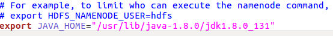

# <center>HDFS的安装、配置与调试</center>
## 1.环境
系统：ubuntu 16.04

内存：4g
## 2.安装jdk以及hadoop
jdk:可以在[oracle](https://www.oracle.com/technetwork/java/javase/downloads/index.html)官网下载

Hadoop:在[apache](http://www.apache.org/dyn/closer.cgi/hadoop/common/)官网下载

下载完成:

解压：
```
在usr/lib下创建文件夹java-1.8.0,将文件解压在其中。
cd /usr/lib/java-1.8.0
tar zxf ./jdk-8u131-linux-x64.tar.gz

在opt/下创建文件夹hadoop,将文件解压在其中。
cd /opt/hadoop
tar zxf ./hadoop-3.2.1.tar.gz
```
## 3.下载ssh、pdsh
```
sudo apt-get install ssh
sudo apt-get install pdsh
```

## 4.进入超级模式
后面很多操作都是需要权限，su模式下更方便，也不容易出错。
```
su
```


## 5.配置环境
### 5.1 修改环境变量
```
编辑 /etc/profile 文件：
gedit /etc/profile
在其后添加如下信息：
export JAVA_HOME=/usr/lib/java-1.8.0/jdk1.8.0_131
export HADOOP_HOME=/opt/hadoop/hadoop-3.2.1
PATH=$JAVA_HOME/bin:$PATH:${HADOOP_HOME}/bin:${HADOOP_HOME}/sbin
CLASSPATH=$JAVA_HOME/jre/lib/ext:$JAVA_HOME/lib/tools.jar
export PATH JAVA_HOME CLASSPATHo
激活环境：
source /etc/profile
```


### 5.2 设置ssh远程无密码登录
```
ssh-keygen -t dsa -P '' -f ~/.ssh/id_dsa
cat ~/.ssh/id_dsa.pub >> ~/.ssh/authorized_keys
chmod 0600 ~/.ssh/authorized_keys
```
成功后能够不用密码便能访问。
```
ssh localhost
```


## 6.搭建环境
1.hdfs(Hadoop Distributed File System)（一个文件系统）
2.yarn(Yet Another Resource Negotiator)(一个资源调度器，安排谁来干什么)
3.map/reduce(计算框架，帮助进行计算)

### 6.1 {HADOOP_HOME}/etc/hadoop/core-site.xml
指出使用的文件系统时啥，在哪，以及hadoop运行期间产生的文件，放在那，这个需要在每台设备上面配置。在core-site.xml中添加信息：

其中的fs.Default的值修改为自己的ip地址。

### 6.2 {HADOOP_HOME}/etc/hadoop/hdfs-site.xml
在hdfs-site.xml中添加信息：

其中的值根据自己的Hadoop版本修改。

### 6.3 /etc/hosts
master需要配置一下域名解析，在/etc/hosts中添加DHCP获取或者自己设置的IP地址到localhost主机名的映射。
```
127.0.0.1   localhost localhost.localdomain localhost4 localhost4.localdomain4 yodosmart.hdfs.01
192.168.1.10   master
::1         localhost localhost.localdomain localhost6 localhost6.localdomain6 yodosmart.hdfs.01
```
如果有存在多个数据服务器，则可以这样设置：
```
192.168.1.10    master
192.168.1.11    slave1
192.168.1.12    slave2
192.168.1.13    slave3
```
hadoop由一台master带起若干台slave（在hadoop3中改为worker）。然后hadoop里面的hdfs也就是master运行nameNode，slave运行dataNode；在yarn中master运行ResourceManager，slave运行NodeManager。
### 6.4 {HADOOP_HOME}/etc/hadoop/hadoop-env.sh
在最后一行添加：
```
export JAVA_HOME=/usr/lib/java-1.8.0/jdk1.8.0_131
```


### 6.5 修改防火墙设置
```#开放9000端口
iptables -I INPUT -p tcp -m tcp --dport 9000 -m state --state NEW,ESTABLISHED -j ACCEPT
#开放9870端口
iptables -I INPUT -p tcp -m tcp --dport 9870 -m state --state NEW,ESTABLISHED -j ACCEPT
```

### 6.6 修改启动文件
在start-hdfs.sh中添加：


### 6.7 格式化namenode
在{HADOOP_HOME}/bin中进行：
```
hdfs namenode -format
```

## 7.运行HDFS
### 7.1 启动
启动HDFS的脚本位于Hadoop目录下的sbin文件夹中，在在{HADOOP_HOME}/sbin中进行:
```
sbin/start-dfs.sh
```
启动成功的话，运行jps命令会显示状况：

如果是分布式启动的话，则：
```
hdfs --daemon start namenode  //master 运行这个命令
hdfs --daemon start datanode  //slave  运行这个命令
```
使用浏览器通过访问网址http://192.168.3.39:9780/可以查看HDFS当前的情况。

### 7.2 python调用
```
pip install pyhdfs
```
需要python2.7版本以上
示例：
```
>>> fs = pyhdfs.HdfsClient(hosts='nn1.example.com:9870,nn2.example.com:50070', user_name='someone')
>>> fs.list_status('/')
[FileStatus(pathSuffix='benchmarks', permission='777', type='DIRECTORY', ...), FileStatus(...), ...]
>>> fs.listdir('/')
['benchmarks', 'hbase', 'solr', 'tmp', 'user', 'var']
>>> fs.mkdirs('/fruit/x/y')
True
>>> fs.create('/fruit/apple', 'delicious')
>>> fs.append('/fruit/apple', ' food')
>>> with contextlib.closing(fs.open('/fruit/apple')) as f:
...     f.read()
...
b'delicious food'
>>> fs.get_file_status('/fruit/apple')
FileStatus(length=14, owner='someone', type='FILE', ...)
>>> fs.get_file_status('/fruit/apple').owner
'someone'
>>> fs.get_content_summary('/fruit')
ContentSummary(directoryCount=3, fileCount=1, length=14, quota=-1, spaceConsumed=14, spaceQuota=-1)
>>> list(fs.walk('/fruit'))
[('/fruit', ['x'], ['apple']), ('/fruit/x', ['y'], []), ('/fruit/x/y', [], [])]
>>> fs.exists('/fruit/apple')
True
>>> fs.delete('/fruit')
Traceback (most recent call last):
  File "<stdin>", line 1, in <module>
  File ".../pyhdfs.py", line 525, in delete
  ...
pyhdfs.HdfsPathIsNotEmptyDirectoryException: `/fruit is non empty': Directory is not empty
>>> fs.delete('/fruit', recursive=True)
True
>>> fs.exists('/fruit/apple')
False
>>> issubclass(pyhdfs.HdfsFileNotFoundException, pyhdfs.HdfsIOException)
True
```

[全部接口文档](https://pyhdfs.readthedocs.io/en/latest/)

### 7.4 关闭
```
sbin/stop-dfs.sh
```